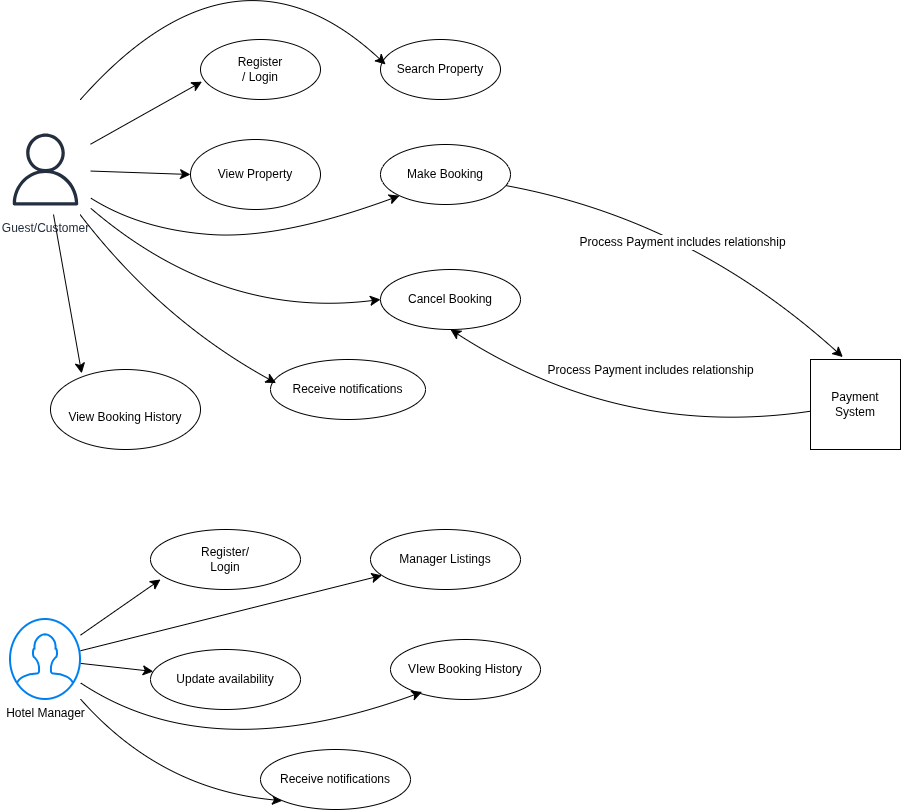

# Requirement Analysis in Software Development

## Introduction

This repository is dedicated to exploring and documenting the principles of **Requirement Analysis** in software development. It serves as a guide to understanding how software teams gather, analyze, and document what needs to be built before writing any code.

## What is Requirement Analysis?

**Requirement Analysis** is like making a wish list before your birthday party. Before your parents buy anything, they ask you: *"What kind of cake do you want? Who should we invite? What games do you want to play?"* They write everything down so they don't forget and so your party turns out exactly how you imagined!

In software development, Requirement Analysis works the same way. Before building an app or website, the team sits down with the people who will use the software (customers, employees, users) and asks lots of questions to understand:
- **What** the software should do
- **Who** will use it
- **How** it should work
- **What problems** it needs to solve

All of these answers get carefully written down and organized so that the development team knows exactly what to build.

### Importance in the SDLC

The **Software Development Life Cycle (SDLC)** is just a fancy name for the steps we follow to build software — like following a recipe to bake cookies. Requirement Analysis is one of the very first and most important steps!

Think of building software like building with LEGO:

1. **Requirement Analysis** ← *We are here!* (Deciding what to build)
2. **Design** (Drawing a picture of what it will look like)
3. **Development** (Actually building it, brick by brick)
4. **Testing** (Making sure it works and nothing falls apart)
5. **Deployment** (Showing it off / letting people use it)
6. **Maintenance** (Fixing things and making improvements)

Requirement Analysis comes **first** because you can't design, build, or test something if you don't know what it's supposed to be!

## Why is Requirement Analysis Important?

Requirement Analysis is super important — like checking your backpack before going to school. If you forget your lunch or homework, your whole day gets harder! Here are the key reasons why it matters:

### 1. Prevents Costly Mistakes 
Imagine building a whole treehouse and *then* finding out your friend wanted a sandbox instead! Fixing mistakes early (during planning) is much easier and cheaper than fixing them later (after building). Studies show that fixing a bug found during requirements costs **10-100 times less** than fixing the same bug after the software is released.

### 2. Ensures Everyone Understands What's Being Built 
Sometimes people have different ideas about what they want. One person might imagine a red bike, another imagines a blue scooter! Requirement Analysis helps everyone — the people who want the software AND the people building it — get on the same page before any work begins. No surprises later!

### 3. Provides a Clear Roadmap for Development 
Once we know what we're building, we can figure out how long it will take, how many people we need, and what tools to use. Without clear requirements, planning is just guessing! It's like trying to pack for a trip without knowing where you're going — you might bring snow boots to the beach!

## Key Activities in Requirement Analysis

Think of Requirement Analysis like planning the perfect birthday party. There are several steps you need to follow to make sure everything goes smoothly:

### 1. Requirement Gathering
This is like going around and asking everyone what they want at the party.
- **What it is:** Collecting information from all the people who will use or be affected by the software (stakeholders)
- **How it's done:** Through interviews, surveys, questionnaires, and studying existing systems
- **Example:** Asking the birthday kid, parents, and friends what food, games, and decorations they want

### 2. Requirement Elicitation
This is digging deeper to find out what people *really* need, even if they didn't say it directly.
- **What it is:** Drawing out hidden or unclear requirements through deeper conversations and techniques
- **How it's done:** Brainstorming sessions, workshops, prototyping, and observation
- **Example:** The birthday kid says "I want a fun party" — you ask more questions to find out *what* makes it fun for them (games? music? a bounce house?)

### 3. Requirement Documentation
This is writing everything down so nobody forgets!
- **What it is:** Recording all the gathered requirements in a clear, organized format
- **How it's done:** Creating requirement specification documents, user stories, and use cases
- **Example:** Making a party checklist:  chocolate cake,  blue balloons,  video games,  10 guests

### 4. Requirement Analysis and Modeling
This is looking at your list and making sure everything makes sense and fits together.
- **What it is:** Examining requirements for conflicts, overlaps, and feasibility; creating visual models
- **How it's done:** Creating diagrams (flowcharts, data models), prioritizing requirements, checking for conflicts
- **Example:** Realizing you can't have a pool party AND a movie party at the same time — you need to pick one or find a compromise

### 5. Requirement Validation
This is double-checking with everyone that you got it right before the party planning begins!
- **What it is:** Confirming that documented requirements accurately reflect what stakeholders actually need
- **How it's done:** Reviews, walkthroughs, prototyping, and getting sign-off from stakeholders
- **Example:** Reading your party checklist back to the birthday kid: "So you want chocolate cake, blue balloons, and video games — is that right?" 

## Types of Requirements

When building software, there are two main types of requirements — like two different kinds of rules for your treehouse. Some rules are about **what the treehouse does** (it has a ladder, a window, a slide), and other rules are about **how well it does it** (it should be strong, safe, and not fall down in the wind).

### Functional Requirements 

**Functional Requirements** describe *what the system should do* — the specific features and functions. Think of these as the "action items" on your checklist.

For the **Hotel Booking System** (like Airbnb/OYO), here are examples:

| Requirement | Description |
|-------------|-------------|
| **User Registration** | The system shall allow users to create an account using email, phone number, or social media login |
| **Search Properties** | Users shall be able to search for hotels by location, date, price range, and amenities |
| **View Listings** | The system shall display property details including photos, descriptions, reviews, and availability |
| **Booking** | Users shall be able to select a property, choose dates, and complete a reservation |
| **Payment Processing** | The system shall integrate with payment services to process credit cards, debit cards, and digital wallets |
| **Booking Management** | Hotel managers shall be able to add, update, and remove property listings |
| **View Booking History** | Users and managers shall be able to view current and past bookings |
| **Notifications** | The system shall send booking confirmations and reminders via email or SMS |

### Non-functional Requirements 

**Non-functional Requirements** describe *how well the system performs* — the quality attributes. Think of these as the "it should be..." requirements.

For the **Hotel Booking System** (like Airbnb/OYO), here are examples:

| Requirement | Description |
|-------------|-------------|
| **Performance** | The system shall load search results within 2 seconds, even with 10,000+ concurrent users |
| **Scalability** | The system shall handle increased traffic during peak seasons using microservice architecture and load balancers |
| **Availability** | The system shall maintain 99.9% uptime (available almost all the time, like a store that never closes) |
| **Security** | User data and payment information shall be encrypted; the system shall comply with data protection standards |
| **Reliability** | The system shall use master-slave database architecture to prevent data loss |
| **Usability** | The booking process shall be completable in no more than 3 steps/clicks |
| **Response Time** | API responses shall be optimized using Redis caching to reduce database load |
| **Data Storage** | The system shall archive old booking data to Cassandra to maintain fast query times |

## Use Case Diagrams

### What are Use Case Diagrams?

Imagine you're explaining to a friend how a video game works. You'd say things like: "The player can jump, run, collect coins, and fight enemies." A **Use Case Diagram** is like drawing a picture that shows all the things different people can do with a system!

Use Case Diagrams are visual representations that show:
- **Actors** — The people or systems that interact with your software (like players in a game)
- **Use Cases** — The actions or tasks they can perform (like "jump" or "collect coins")
- **Relationships** — How actors and actions are connected

### Benefits of Use Case Diagrams

- **Easy to understand** — Even people who aren't tech experts can look at the picture and understand what the system does
- **Shows the big picture** — You can see all the features and who uses them at a glance
- **Helps find missing requirements** — When you draw it out, you might notice "Oh wait, we forgot about this!"
- **Great for communication** — Developers, designers, and clients can all look at the same picture and agree on what's being built
- **Identifies actors clearly** — You know exactly who will use the system and what they need

### Use Case Diagram for Hotel Booking System

Below is the Use Case Diagram for our booking management system, showing the main actors and their interactions:

#### Actors:
| Actor | Description |
|-------|-------------|
| **Guest/Customer** | A user who searches for properties, makes bookings, and manages their reservations |
| **Hotel Manager** | A user who manages property listings, updates availability, and views bookings |
| **Payment System** | External service that processes payments (e.g., Stripe, PayPal) |

#### Use Cases:
| Use Case | Description |
|----------|-------------|
| **Register/Login** | Users create an account or sign in to access the system |
| **Search Properties** | Guests search for hotels by location, dates, and filters |
| **View Property Details** | Users view photos, amenities, reviews, and pricing |
| **Make Booking** | Guests select dates and reserve a property |
| **Process Payment** | System handles payment through external payment gateway |
| **Cancel Booking** | Users cancel their reservations |
| **View Booking History** | Users view their past and current bookings |
| **Manage Listings** | Hotel managers add, edit, or remove their properties |
| **Update Availability** | Managers update room availability and pricing |
| **Receive Notifications** | Users get booking confirmations and reminders |

## Acceptance Criteria

### What is Acceptance Criteria?

Imagine you ask your mom to make you a sandwich. But you're picky! So you tell her exactly what you want:
- "It MUST have peanut butter"
- "It MUST have jelly"
- "It MUST be on white bread"
- "It MUST NOT have the crusts"

If she makes it and it matches ALL those rules, you accept it. If not, you send it back! 

**Acceptance Criteria** are the specific conditions that a software feature must meet to be accepted by the user, customer, or stakeholder. They're like a checklist that says "this feature is DONE and WORKING correctly."

### Why is Acceptance Criteria Important?

| Benefit | Description |
|---------|-------------|
| **Clear Expectations** | Everyone knows exactly what "done" looks like — no confusion! |
| **Testable** | QA teams can create tests based on these criteria to verify the feature works |
| **Prevents Scope Creep** | Keeps the team focused on what was agreed upon, not endless additions |
| **Shared Understanding** | Developers, testers, and clients all agree on what the feature should do |
| **Basis for Acceptance** | Provides clear grounds for accepting or rejecting a delivered feature |

### Example: Acceptance Criteria for Checkout Feature

For the **Checkout Feature** in the booking management system, here's an example of well-written Acceptance Criteria:

**Feature:** Checkout Process for Hotel Booking

| # | Acceptance Criteria |
|---|---------------------|
| 1 | The system shall display a booking summary showing property name, dates, number of guests, and total price before payment |
| 2 | The user shall be able to select from at least two payment methods (credit card, PayPal, etc.) |
| 3 | The system shall validate the payment card details (card number, expiry date, CVV) before processing |
| 4 | The system shall process the payment within 30 seconds and display a confirmation or error message |
| 5 | Upon successful payment, the system shall send a booking confirmation email to the user within 2 minutes |
| 6 | The system shall display a booking confirmation page with a unique booking reference number |
| 7 | If payment fails, the system shall display an error message and allow the user to retry or choose a different payment method |
| 8 | The system shall not charge the user if the booking is not confirmed |
| 9 | The checkout process shall be completable within 3 steps (Review → Payment → Confirmation) |
| 10 | All payment data shall be transmitted securely using encryption (HTTPS/SSL) |
